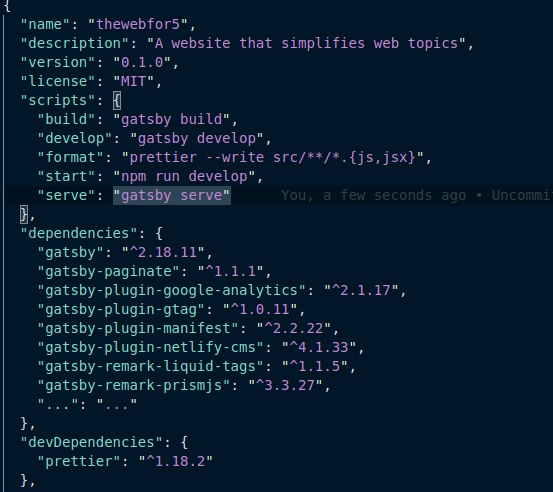
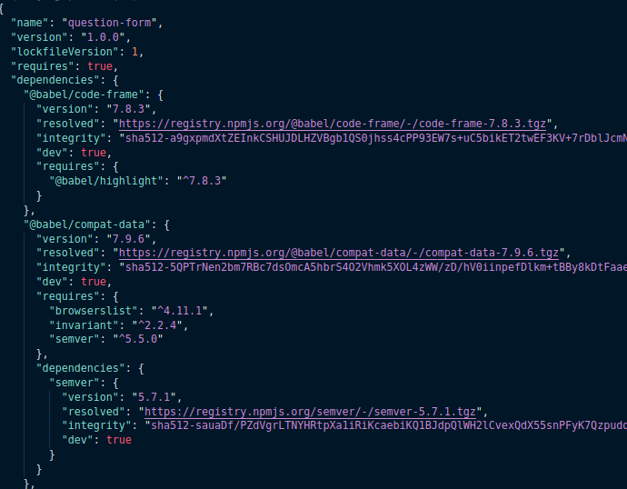

`package.json` and `package-lock.json` are two very common files you'll find in most packages.

What is the purpose of `package-lock.json`? Why is `package-lock.json` longer? Why do packages work perfectly without `package-lock.json`? Do I need to use the two in my package? What are the differences?

In this article, we'd answer all the questions above.

## `package-json`

This is a file usually found in packages. It contains meta-information about the package like versioning information, what the package is about, dependencies of the package, how to set up the package and so much more.

A typical package.json looks like this:



Let's look at a few of those properties.

### Properties of `package.json`

-   `name`: The name of your package.
-   `description`: The purpose of your package.
-   `main`: The path to the default file which Node.js uses as a starting point for your package. In cases where your package is required without a path to a file (like this: `require('package-name')`), the main file is used.
-   `scripts`: It contains a list of custom scripts which can be run with npm.
-   `dependencies`: It contains dependencies which would be required by your package to work.
-   `devDependencies`: It contains dependencies which are not required for your package to be used during production.

package.json holds important information of your package.

You'd also notice the caret symbol (`^`) used in front of the dependencies' version numbers. This symbol signifies to npm that higher major versions of this package can be installed.

When you install a package with `npm` like this:

```bash
npm install <package-name> --save
```

The package would be saved in package.json's `dependencies` object with a value of '^<the-current-version>'.

Let's say you pushed that project to a repository and cloned it on another system. When you run `npm install` on that other system, with the symbol there, `npm` would check if there is a higher major version, and if there is, that version is installed.

This feature comes with a good and a bad side effect.

> A higher major version of a package with 1.3.5 can be 1.4.7, 1.9.3 but cannot be 2.0.0 or more.

-   **Good**: you always get to use the latest versions of packages.
-   **Bad**: you always get to use the latest versions of packages.

??

Ok, the bad side is that latest versions may contain bugs or may contain incompatible codes for your codebase. `npm` released the `package-lock.json` file to solve this issue.

## `package-lock.json`

The common method of starting a package is `npm init`. After doing this, a `package.json` file is created. But when you install a package, you'd notice the `package-lock.json` file (usually very long) automatically created.

Here's a typical example of a `package-lock.json` file:



You'll find this file a bit similar to `package.json` - holding some information about your file, but there's more to it. Remember the `caret` symbol in `package.json` dependencies? You could manually remove that symbol when you install a dependency, but that would be stressful.

With `package-lock.json`, the versions of all dependencies your package would need are locked (**-lock**). This means when you run `npm install` on another system, npm checks this file to install the exact versions of the dependencies. If this file is absent, `npm` would then work with the `caret` symbol.

This means that you should also **commit package-lock.json to your source control**.

The major benefit of this file is that when your package is working perfectly (with all the dependencies used) on your system, you are sure that any attempt to install the package on another system would work exactly. It ensures similar dependencies in various environments where the package is being worked on.

### Why is this file longer?

It doesn't only lock the version of the packages in the `package.json`. It locks all versions of the dependencies and sub dependencies (and sub, sub, sub) that your package would need. While `package-json` shows you `express`, `package-lock.json` would show you a dependency of `express`.

## Packages without `package-lock.json`?

Some packages work effectively without this file despite the benefit it brings. However, these packages are prone to bugs (from new releases of their dependencies).

[Deleting the `package-lock.json` file] has also been a popular recommended solution to some errors. Several misconceptions lead to this solution. However, there are [better solutions than deleting the lock file](https://stackoverflow.com/questions/54124033/deleting-package-lock-json-to-resolve-conflicts-quickly).

## Wrap up

**What is the purpose of package-lock.json?**, **Why is package-lock.json longer?**, **Why do packages work perfectly without package-lock.json?**, **Do I need to use the two in my package?**, **What are the differences?** - I believe all these questions (and probably more) have been answered.

Your package can exist without package-lock.json but you should understand what you're doing, and you shouldn't create ease of management or contribution for 'as long as it works'.

## Read More

-   [Everything You Wanted To Know About package-lock.json But Were Too Afraid To Ask](https://medium.com/coinmonks/everything-you-wanted-to-know-about-package-lock-json-b81911aa8ab8)

Thanks for reading : )
